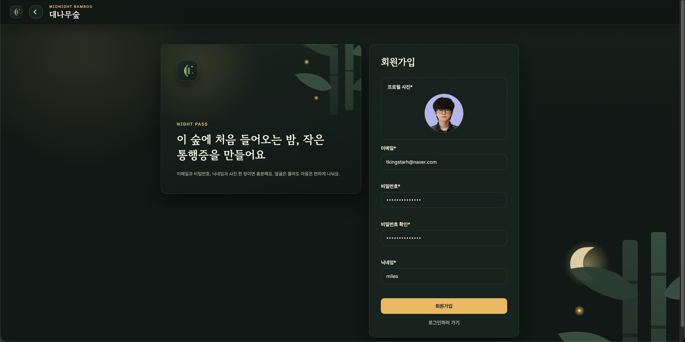
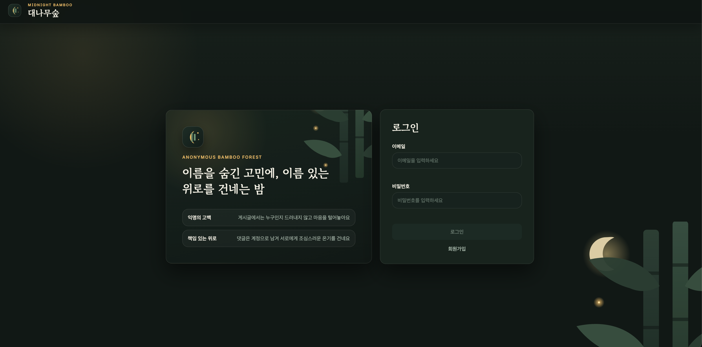
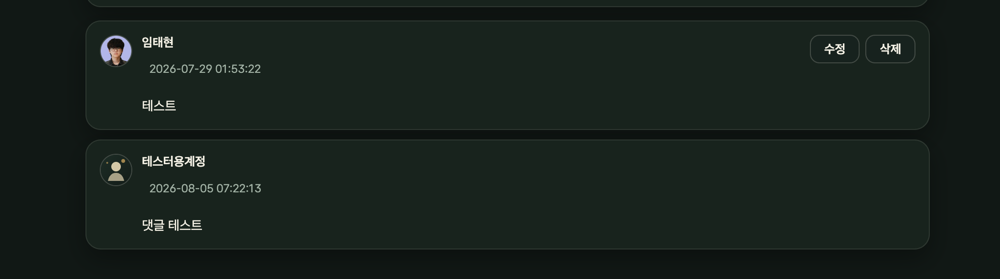
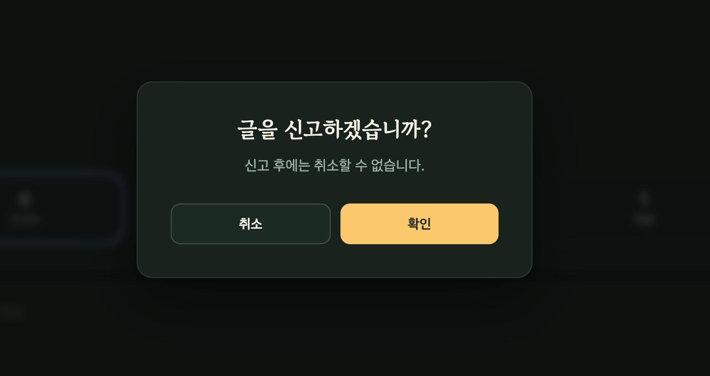
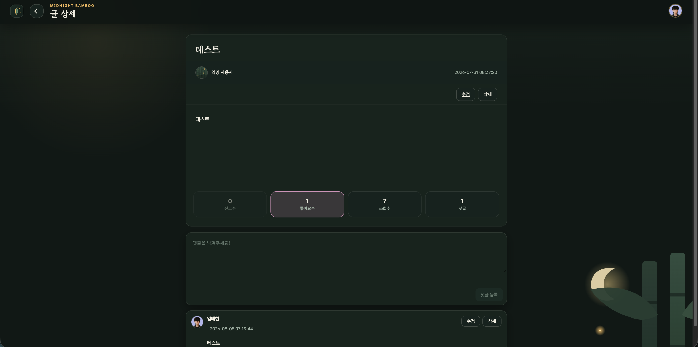

# Bamboo Board Frontend

대나무숲 콘셉트의 익명 게시판 서비스 프론트엔드입니다. 회원 인증, 게시글·댓글·좋아요·신고, 프로필 관리 화면을 제공합니다.

## 소개

Bamboo Board는 사용자가 익명으로 게시글을 작성하고 댓글과 좋아요로 소통할 수 있는 커뮤니티 서비스입니다.

프론트엔드는 인증 상태에 따른 라우팅과 공통 UI를 구성하고, 게시글·댓글·사용자 기능을 백엔드 API와 연결했습니다. 모바일과 데스크톱에서 핵심 흐름을 쉽게 사용할 수 있도록 게시글 목록과 상세 화면을 중심으로 구성했습니다.

## 개발 인원 및 기간

- 개발 기간 : 2026-05-25 ~ 2024-08-09
- 개발 인원 : 프론트엔드/백엔드 1명 (본인)

## 사용 기술 및 툴

- React 19
- React Router 7
- CSS
- Docker, Nginx
- GitHub Actions 기반 Blue/Green 배포


## 폴더 구조

```text
src
├── api          # 백엔드 API 호출과 응답 정규화
├── assets       # 이미지와 폰트
├── auth         # 인증 상태 저장
├── components
│   ├── auth     # 로그인·회원가입 폼
│   ├── common   # 공통 버튼·입력·모달·에러 UI
│   ├── layout   # 헤더와 페이지 레이아웃
│   ├── posts    # 게시글·댓글·좋아요·신고 UI
│   └── user     # 프로필·비밀번호 UI
├── pages        # 라우트별 페이지
├── routes       # 공개·보호 라우트
├── styles       # 인증·게시글·사용자·공통 스타일
└── utils        # 파일, 검증, 포맷팅 유틸리티
```

## Back-end

- (https://github.com/100-hours-a-week/KTB4_Miles_Week12_Back)

## 서비스 화면

<table cellspacing="12" cellpadding="8">
<tr>
<td align="center" valign="bottom" width="33%"><br><sub>회원가입.png</sub></td>
<td align="center" valign="bottom" width="33%"><br><sub>로그인.png</sub></td>
<td align="center" valign="bottom" width="33%"><br><sub>게시물 목록.png</sub></td>
</tr>
<tr>
<td align="center" valign="bottom" width="33%"><br><sub>게시물 상세.png</sub></td>
<td align="center" valign="bottom" width="33%"><br><sub>게시글 사진 첨부.png</sub></td>
<td align="center" valign="bottom" width="33%"><br><sub>게시글 수정.png</sub></td>
</tr>
<tr>
<td align="center" valign="bottom" width="33%"><br><sub>게시글 삭제.png</sub></td>
<td align="center" valign="bottom" width="33%"><br><sub>댓글.png</sub></td>
<td align="center" valign="bottom" width="33%"><br><sub>댓글 삭제.png</sub></td>
</tr>
<tr>
<td align="center" valign="bottom" width="33%"><br><sub>댓글 수정.png</sub></td>
<td align="center" valign="bottom" width="33%"><br><sub>신고.png</sub></td>
<td align="center" valign="bottom" width="33%"><br><sub>신고된 게시글.png</sub></td>
</tr>
<tr>
<td align="center" valign="bottom" width="33%"><br><sub>좋아요.png</sub></td>
<td align="center" valign="bottom" width="33%"><br><sub>비밀번호 수정.png</sub></td>
<td align="center" valign="bottom" width="33%"><br><sub>회원정보 수정.png</sub></td>
</tr>
</table>

## 서비스 시연 영상

[실행 영상](<readme/실행 영상.mov>)

## 트러블 슈팅

### 액세스 토큰 만료로 회원정보 수정이 실패하던 문제

액세스 토큰의 만료 시간이 지난 뒤 회원정보를 수정하면 401 응답 후 로그인 화면으로 이동하면서 입력 중이던 내용이 사라지는 문제가 있었습니다. 원인은 토큰 재발급을 건너뛸 경로를 URL만 비교하고 있었기 때문입니다. `/users` 아래의 회원가입뿐 아니라 회원정보 수정과 회원 탈퇴까지 재발급 제외 대상으로 판단하고 있었습니다.

재발급을 건너뛰어야 하는 요청을 `POST /users`로 한정하고, API 요청 시 경로와 HTTP 메서드를 함께 비교하도록 수정했습니다. 그 결과 회원가입은 재발급을 시도하지 않고, 인증이 필요한 회원정보 수정과 탈퇴 요청은 만료된 액세스 토큰을 리프레시 토큰으로 갱신한 뒤 계속 처리할 수 있게 되었습니다.

### 실패 요청과 이전 응답이 화면 상태를 덮어쓰던 문제

게시글 목록·상세·수정 페이지에서 API 요청이 실패하면 콘솔에만 오류를 남겨 화면이 비어 보였습니다. 또한 페이지를 이동한 뒤 이전 요청의 응답이 늦게 도착하면 현재 화면의 상태를 덮어쓸 가능성도 있었습니다.

요청 실패를 오류 상태로 저장해 공통 `ErrorView`가 표시되도록 하고, 페이지가 바뀌면 `AbortController`로 진행 중인 요청을 취소했습니다. effect 정리 로직도 적용해 더 이상 사용하지 않는 요청이 현재 화면을 변경하지 않도록 했습니다.


### 백엔드 재배포 후 프론트엔드에서 502가 발생하던 문제

당시 배포 환경에서는 Nginx가 백엔드 컨테이너 이름을 시작 시점에 IP로 해석하고 있어, 백엔드 컨테이너만 다시 생성하면 기존 IP로 요청을 보내는 문제가 있었습니다. 프론트엔드 컨테이너는 실행 중이지만 API 요청만 502가 되는 형태라 원인을 찾기 어려웠습니다.

현재 배포 구성에서는 프론트엔드 Nginx가 `BACKEND_UPSTREAM` 환경 변수로 전달된 백엔드 주소를 사용합니다. 백엔드 컨테이너가 교체되어 내부 IP가 바뀌더라도 프론트엔드가 이전 컨테이너 IP를 직접 참조하지 않도록 구성했습니다.

## 프로젝트 후기

처음에는 Figma 화면을 구현하고 API를 연결하는 것에 집중했습니다. 작업을 진행할수록 화면을 만드는 것만큼 공통 컴포넌트와 상태 흐름을 정리하는 일이 중요하다는 것을 느꼈고, 반복되는 입력·버튼·헤더를 분리하면서 변경하기 쉬운 구조를 고민하게 되었습니다.

가장 기억에 남는 경험은 액세스 토큰이 만료된 상태에서 회원정보 수정이 실패하던 문제를 해결한 일이었습니다. 단순히 오류 문구를 바꾸는 것으로 끝내지 않고, 어떤 요청만 토큰 재발급을 건너뛰어야 하는지와 사용자가 입력한 내용을 잃지 않으려면 어떻게 해야 하는지를 함께 생각했습니다. 이 경험을 통해 프론트엔드는 성공한 화면뿐 아니라 인증 만료와 요청 실패 이후의 흐름까지 설계해야 한다는 점을 배웠습니다.

React의 기능을 모두 사용하는 것보다 현재 요구사항에 필요한 기술을 선택하는 것이 더 중요하다는 것도 알게 되었습니다. Context, Portal, Concurrent Rendering, SSR을 사용하지 않은 이유를 정리하면서 기술을 적용한 개수보다 선택의 근거를 설명할 수 있는지가 중요하다고 느꼈습니다.

AI는 구현 속도를 높여주는 도구였지만, 생성된 코드가 실제 요구사항과 실패 상황까지 다루는지는 직접 확인해야 했습니다. 앞으로는 주요 화면의 정상 흐름뿐 아니라 오류·재시도 흐름도 자동화 테스트로 남겨, 변경 이후에도 동작을 믿을 수 있는 프론트엔드를 만들고 싶습니다.
